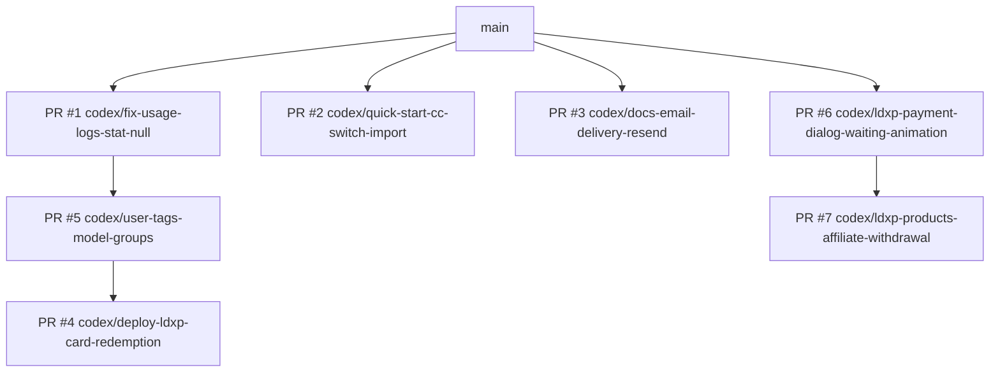

# GitHub 项目脉络与维护台账

> 快照时间：2026-06-30 21:45 +0800（Asia/Shanghai）
>
> 数据来源：本地 Git checkout、`git fetch --all --prune --tags` 后的引用、GitHub CLI 读取的仓库 / PR / issue 元数据。
>
> 维护原则：本文件只记录项目管理脉络、分支关系、工作数量和 GitHub 流程，不记录 token、cookie、私钥、后台账号、支付密钥、完整 session id 或任何生产敏感值。

## 1. 仓库概况

| 项目 | 当前值 |
|------|--------|
| GitHub 仓库 | `chenli17683185032-ai/yunbay` |
| 可见性 | Private |
| 默认分支 | `main` |
| 当前本地工作分支 | `codex/fix-usage-logs-stat-null` |
| 主语言 | Go |
| License | GNU Affero General Public License v3.0 |
| GitHub issue | `0` 个开放 issue |
| GitHub PR | `7` 个开放 PR，全部为 Draft |
| GitHub Actions workflow | `7` 个 workflow |
| Git tag | 本地 `0` 个，远端 `0` 个 |

## 2. 当前工作数量盘点

### 2.1 Git 历史与引用数量

| 指标 | 数量 / 状态 |
|------|-------------|
| 全引用可达提交数 | `6071` |
| 当前 `HEAD` 提交数 | `5942` |
| `origin/main` 提交数 | `5922` |
| 当前 `HEAD` 相对 `origin/main` | 领先 `20`，落后 `0` |
| 当前 `HEAD` 相对 `origin/codex/fix-usage-logs-stat-null` | 领先 `5`，落后 `0` |
| 本地分支 | `18` 个 |
| 远端 head | `10` 个 |
| 本地与远端同名分支 | `9` 个 |
| 仅本地存在的分支 | `9` 个 |
| 仅远端存在的分支 | `1` 个 |

### 2.2 当前工作区数量

当前工作区仍有 `4` 个未提交文件，均属于 `infra/sub2api/**`，未纳入本轮 GitHub 文档维护：

```text
infra/sub2api/backend/internal/server/middleware/api_key_auth.go
infra/sub2api/backend/internal/server/middleware/api_key_auth_google.go
infra/sub2api/backend/internal/server/middleware/api_key_auth_google_test.go
infra/sub2api/backend/internal/server/middleware/api_key_auth_test.go
```

处理原则：

- 不与 README、`.github` 或生产维护文档混合提交；
- 在确认生产是否使用、业务语义是否正确、测试是否覆盖前，不作为已上线事实记录；
- 若后续处理，应单独建账、单独验证、单独提交或丢弃。

### 2.3 文档与 GitHub 配置资产数量

| 范围 | 文件数 | 说明 |
|------|--------|------|
| `.github/` | `17` | 包含本文件、PR 模板、issue 模板、安全政策、workflow 与资助配置 |
| `.github/workflows/` | `7` | GitHub Actions workflow |
| `.github/ISSUE_TEMPLATE/` | `5` | 中英文 bug / feature 模板与模板配置 |
| `docs/` | `41` | 项目文档、生产维护记录、OpenAPI、图片与 superpowers 计划 / spec |
| `docs/superpowers/specs/` | `11` | 设计 spec 与生产完成 / 灰测补记 |
| `docs/superpowers/plans/` | `13` | 实施计划与维护计划 |

### 2.4 本地已补入当前分支但尚未推到远端当前分支的文档维护提交

当前 `codex/fix-usage-logs-stat-null` 本地 `HEAD` 比 `origin/codex/fix-usage-logs-stat-null` 领先 `5` 个提交：

```text
0a420c3c docs: record yunbay email delivery setup
e9fd5237 docs: add append-only maintenance audit log
0add7b20 docs: record full rollout announcement completion
2101db9e docs: record user tags and claude wallet completion
<本文件所在提交> docs: add github project maintenance context
```

这些提交主要是补齐已经完成生产同步、生产灰测或维护审计的文档事实。若希望 GitHub PR 页面展示这些维护记录，需要先推送当前分支。

## 3. 分支与 PR 脉络

### 3.1 当前开放 PR

| PR | 状态 | Head → Base | 规模 | 当前结论 |
|----|------|-------------|------|----------|
| [#1](https://github.com/chenli17683185032-ai/yunbay/pull/1) | Draft / Mergeable | `codex/fix-usage-logs-stat-null` → `main` | `57` files, `+7652/-215` | 当前维护主干 PR；本地还有 `5` 个文档提交未推送到远端分支 |
| [#2](https://github.com/chenli17683185032-ai/yunbay/pull/2) | Draft / Mergeable | `codex/quick-start-cc-switch-import` → `main` | `15` files, `+746/-41` | Quick Start / CC Switch 导入相关独立 PR |
| [#3](https://github.com/chenli17683185032-ai/yunbay/pull/3) | Draft / Mergeable | `codex/docs-email-delivery-resend` → `main` | `3` files, `+160/-0` | 邮件链路文档 PR；当前分支已另行补充更完整维护记录 |
| [#4](https://github.com/chenli17683185032-ai/yunbay/pull/4) | Draft / Mergeable | `codex/deploy-ldxp-card-redemption` → `codex/user-tags-model-groups` | `42` files, `+2554/-143` | 卡密兑换链路，依赖用户标签 / 模型分组基线 |
| [#5](https://github.com/chenli17683185032-ai/yunbay/pull/5) | Draft / Conflicting | `codex/user-tags-model-groups` → `codex/fix-usage-logs-stat-null` | `56` files, `+8986/-6943` | 用户标签 / 模型分组分离；GitHub 当前显示冲突，合并前需重算基线 |
| [#6](https://github.com/chenli17683185032-ai/yunbay/pull/6) | Draft / Mergeable | `codex/ldxp-payment-dialog-waiting-animation` → `main` | `129` files, `+21495/-331` | LDXP 支付等待反馈，规模较大，建议拆分复核风险点 |
| [#7](https://github.com/chenli17683185032-ai/yunbay/pull/7) | Draft / Mergeable | `codex/ldxp-products-affiliate-withdrawal` → `codex/ldxp-payment-dialog-waiting-animation` | `50` files, `+4440/-207` | LDXP 商品、返利、提现等后续能力，依赖 #6 |

### 3.2 推荐阅读 / 合并顺序

当前 GitHub PR 不是一条简单线性队列，而是由三组工作组成：



维护建议：

1. 先处理 `codex/fix-usage-logs-stat-null` 这条当前维护主干，并确认本地 `5` 个文档补记是否推送。
2. 再处理用户标签 / 模型分组与卡密兑换链路：`#5` 当前冲突，`#4` 又依赖 `#5`，因此不要先合并 `#4`。
3. LDXP 支付等待、商品、返利、提现链路按 `#6` → `#7` 顺序复核。
4. `#2` Quick Start 与 `#3` 邮件文档相对独立，但需要注意当前分支已有更完整的生产维护记录，避免重复或回退。

### 3.3 本地 / 远端分支差异

仅本地存在的分支：

```text
codex/claude-pricing-wallet-gray
codex/full-rollout-no-overlap
codex/full-rollout-no-overlap-clean
codex/ldxp-browser-worker-hk-proxy
codex/ldxp-card-redemption
codex/ldxp-card-redemption-backend-controller
codex/ldxp-card-redemption-backend-model
codex/ldxp-card-redemption-frontend-admin
codex/ldxp-card-redemption-wallet
```

仅远端存在的分支：

```text
codex/jeepay-alipay-admin
```

处理这些分支前，先确认：

- 是否已经被纳入 `codex/full-rollout-no-overlap-clean` 或当前维护主干；
- 是否已有生产同步记录；
- 是否需要推送、归档、重建 PR，还是只保留为历史工作分支；
- 不要用 `reset --hard`、`git clean` 或删除分支来代替审计。

## 4. GitHub Actions 脉络

| Workflow | 触发方式 | 主要作用 |
|----------|----------|----------|
| `docker-build.yml` | tag push、manual | 发布 Docker Hub multi-arch 正式镜像，带 cosign 签名 |
| `docker-image-alpha.yml` | `alpha` 分支 push、manual | 发布 Docker Hub 与 GHCR alpha 镜像 |
| `docker-image-nightly.yml` | `nightly` 分支 push、manual | 发布 Docker Hub nightly 镜像 |
| `electron-build.yml` | stable tag push、manual | 构建 Windows Electron 安装包并上传 release artifact |
| `pr-check.yml` | PR opened / reopened | 使用 anti-slop 检查 PR 模板、描述质量、账号基础风险；不等同于完整测试 |
| `release.yml` | tag push、manual | 构建 Linux / macOS / Windows release artifacts |
| `sync-to-gitee.yml` | manual | 按指定 tag 同步 GitHub release 到 Gitee |

注意：

- `pr-check.yml` 只在 `opened` / `reopened` 触发，不覆盖每次 push；
- 通过 PR check 不代表后端测试、前端构建、数据库兼容或生产冒烟已经通过；
- 需要发 PR 时必须使用 `.github/PULL_REQUEST_TEMPLATE.md`，并保留模板结构；
- 如果当前 Git 作者不是历史核心开发者，PR 正文应按项目规则说明 AI-generated 或 AI-assisted 贡献。

## 5. GitHub 文档维护规则

`.github` 目录当前承担以下职责：

| 文件 / 目录 | 作用 |
|-------------|------|
| `.github/PULL_REQUEST_TEMPLATE.md` | PR 模板与提交前检查项 |
| `.github/ISSUE_TEMPLATE/` | Bug / feature issue 模板 |
| `.github/SECURITY.md` | 安全报告流程与支持版本 |
| `.github/workflows/` | GitHub Actions 工作流 |
| `.github/README.md` | 当前 GitHub 项目脉络、工作数量、PR 队列与维护规则 |

后续维护规则：

- 更新 PR、issue、workflow 或分支队列后，应追加更新本文件的快照时间和相关计数；
- 若只是在 README 维护日志中补记生产事实，不要顺手修改 workflow；
- 若修改 workflow，必须说明触发条件、权限、secret 依赖和验证方式；
- 不要在 `.github` 文档中写入 GitHub token、Docker Hub token、Gitee token、SSH key、生产 cookie 或任何可复用凭据；
- 不要删除或替换受保护的项目标识、上游归属、license 和安全政策信息。
