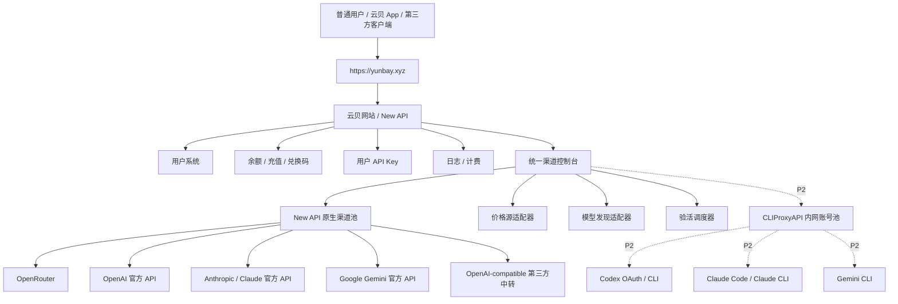

# 云贝统一渠道控制台设计说明

日期：2026-06-15  
范围：云贝网站 / New API 管理员后台  
状态：设计稿，等待用户 review 后进入实施计划

## 1. 背景与目标

云贝网站当前基于 New API，已经具备用户、余额、用户 API Key、渠道、日志、计费和后台设置等基础能力。管理员现在需要一个更便捷的图形化控制台，用来管理所有上游渠道，尤其是第三方 API。这个控制台应像云贝 App 的“凭证管理”一样直观：管理员复制 API 信息进去，系统自动识别、创建渠道、拉取模型、同步价格、验活，并把异常渠道明显标红。

第一版的核心目标不是替换 New API 的所有高级渠道设置，而是把管理员最高频的第三方 API 运营动作做顺：

1. **导入便捷**：直接复制 API Key、curl、JSON、Base URL + Key 或请求头片段即可导入。
2. **模型自动识别**：导入后自动识别供应商，自动获取可用模型列表。
3. **自动计费**：OpenRouter 使用 OpenRouter 模型价格信息；官方 API 使用对应官方价表；价格归一化后写入云贝 / New API 计费配置。
4. **定期验活**：导入后立即验活，后台定期复验，把失效 API、失效 Key、异常渠道标红。
5. **统一视图**：一个控制台展示第三方 API、多 Key、将来的 OAuth / CLI 凭证池；原 New API 渠道页保留为“高级渠道管理”。

## 2. 非目标

第一版明确不做以下事项：

1. 不删除或替换 New API 原生渠道管理页；原页面保留为高级页和兜底页。
2. 不把 CLIProxyAPI 直接裸露给普通用户或公网；后续如接入，优先作为 Docker 内网服务。
3. 不让普通用户看到统一渠道控制台；只对管理员 / root 开放。
4. 不保证所有第三方中转 API 都能完全自动定价；价格未知时必须标黄并要求管理员确认后才能启用。
5. 不把实时价表硬编码在前端；所有价格通过后端价格源适配器、缓存、同步任务和管理员覆盖来管理。
6. 不在日志、响应、前端列表中显示完整 API Key 或 OAuth 凭证。

## 3. 总体架构



### 3.1 用户入口

用户入口保持不变：

```text
https://yunbay.xyz
```

普通用户、云贝 App、第三方客户端都只访问云贝网站 / New API。统一渠道控制台只影响管理员如何配置上游，不改变普通用户的登录、余额、API Key 和请求入口。

### 3.2 管理员入口

云贝后台新增菜单：

```text
统一渠道控制台
```

原有渠道页保留并改为更明确的入口名称：

```text
高级渠道管理
```

日常操作使用“统一渠道控制台”；复杂参数、特殊映射、低频高级设置仍可进入“高级渠道管理”。

### 3.3 P0 / P1 / P2 范围

| 优先级 | 范围 | 说明 |
| --- | --- | --- |
| P0 | 第三方 API 快速导入、模型发现、价格同步、验活标红 | 第一版主线 |
| P1 | 统一控制台视图、详情抽屉、批量操作、异常过滤 | 第一版一起完成，但不追求覆盖所有高级设置 |
| P2 | CLIProxyAPI / OAuth / CLI 凭证池 | 架构预留，后续接入 |

## 4. 管理员 UI 设计

### 4.1 页面布局

统一渠道控制台采用“列表 + 快速导入 + 详情抽屉”的结构。

页面顶部：

```text
统计卡片：
- API 渠道总数
- 可用凭证数 / 总凭证数
- 已发现模型数
- 价格同步状态
- 验活状态
```

页面主体左侧：

```text
渠道列表：
- 渠道名称
- 供应商
- 渠道类型
- Base URL
- Key 数量
- 模型数量
- 计费来源
- 价格同步状态
- 验活状态
- 最后验活时间
- 最近错误
- 轮询策略
- 操作
```

页面主体右侧或顶部弹窗：

```text
快速导入框：
- 粘贴 API Key
- 粘贴多行 API Key
- 粘贴 curl
- 粘贴 JSON
- 粘贴 Base URL + Key
- 粘贴 Authorization 请求头片段
```

渠道详情抽屉：

```text
Tabs:
1. 概览
2. 凭证 / Key
3. 模型
4. 价格
5. 验活记录
6. 高级设置跳转
```

### 4.2 状态颜色

| 颜色 | 状态 | 含义 |
| --- | --- | --- |
| 绿色 | healthy | 渠道和核心模型可用，价格已同步 |
| 黄色 | warning / unchecked / price_unknown | 部分模型异常、价格待确认、待验活或同步失败但仍有旧数据 |
| 红色 | failed | 认证失败、连续失败、Base URL 不可达、核心模型不可用、价格缺失且无法计费 |
| 灰色 | disabled | 管理员禁用或自动禁用 |

### 4.3 高频操作

控制台第一版需要提供以下操作：

```text
导入凭证
重新拉取模型
同步价格
立即验活
查看失败原因
启用 / 禁用渠道
启用 / 禁用单个 Key
编辑渠道基础信息
跳转高级渠道管理
```

## 5. 导入流程设计

### 5.1 支持的输入形态

管理员可以直接粘贴以下任一内容：

```text
sk-redacted-example
sk-or-redacted-example
多个 Key，每行一个
curl https://api.openai.com/v1/chat/completions -H "Authorization: Bearer sk-..."
curl https://openrouter.ai/api/v1/chat/completions -H "Authorization: Bearer sk-or-..."
Authorization: Bearer sk-...
Base URL: https://example.com/v1
Key: sk-...
JSON 格式的渠道配置
```

### 5.2 识别步骤

导入解析器按以下顺序处理：

```text
1. 解析 curl / JSON / 文本结构
2. 提取 Base URL
3. 提取 Authorization / API Key
4. 根据域名、Key 前缀、Header、路径判断供应商
5. 识别接口格式：OpenAI-compatible / Anthropic / Gemini / OpenRouter / Custom
6. 识别模型发现方式
7. 识别价格来源
8. 生成导入预检结果
```

### 5.3 导入预检

保存前必须展示预检结果，管理员确认后才写入数据库：

```text
识别结果：
- 供应商
- 接口格式
- Base URL
- Key 数量
- 是否多 Key
- 默认模型发现方式
- 默认价格来源
- 默认测试模型
- 将创建新渠道还是追加到已有渠道
- 未识别或需要人工确认的字段
```

对无法可靠识别的内容，控制台必须要求管理员选择：

```text
供应商类型
Base URL
价格模板
模型启用策略
```

### 5.4 写入 New API 渠道

普通第三方 API 最终写入 New API 原生渠道系统。第一版优先复用已有能力：

```text
POST /api/channel/
PUT /api/channel/
GET /api/channel/test/:id
GET /api/channel/fetch_models/:id
POST /api/channel/multi_key/manage
```

多 Key 渠道使用 New API 现有 ChannelInfo：

```text
is_multi_key
multi_key_size
multi_key_status_list
multi_key_disabled_reason
multi_key_disabled_time
multi_key_polling_index
multi_key_mode: random / polling
```

## 6. 模型自动识别设计

### 6.1 模型发现优先级

```text
供应商专用模型接口
  ↓
OpenAI-compatible /v1/models
  ↓
内置模型模板
  ↓
管理员手动填写
```

### 6.2 各供应商策略

| 供应商 | 模型发现策略 | 价格来源策略 |
| --- | --- | --- |
| OpenRouter | 调用 OpenRouter models endpoint | OpenRouter 模型价格元数据 |
| OpenAI 官方 | 调用 OpenAI models endpoint + 内置可计费模型模板 | OpenAI 官方价表适配器 |
| Anthropic / Claude 官方 | 使用 Anthropic 模型信息 + 内置 Claude 模型模板 | Anthropic 官方价表适配器 |
| Google Gemini 官方 | 使用 Gemini 模型信息 + 内置 Gemini 模型模板 | Google Gemini 官方价表适配器 |
| OpenAI-compatible 第三方中转 | 尝试 `/v1/models` | 优先匹配 OpenRouter / 官方模型名；失败则人工选择模板 |

### 6.3 模型启用策略

导入时提供三个选择：

```text
只启用推荐模型
启用全部已知价格模型
手动选择模型
```

默认建议：

```text
只启用推荐模型 + 价格未知模型不自动启用
```

这样可以避免未知价格模型被用户调用后造成亏损。

### 6.4 模型状态

每个发现的模型有以下状态：

```text
discovered：已发现但未启用
enabled：已启用
price_unknown：价格未知，不能自动启用
test_failed：模型验活失败
disabled：管理员禁用
```

## 7. 自动计费设计

### 7.1 价格源

第一版价格源适配器包括：

```text
OpenRouterPriceSource
OpenAIPriceSource
AnthropicPriceSource
GeminiPriceSource
ManualPriceTemplateSource
```

价格源职责：

```text
拉取或解析当前价表
归一化模型名
输出标准价格结构
记录来源、同步时间和失败原因
```

### 7.2 标准价格结构

后端统一使用标准结构，不直接把不同供应商价表塞进 New API 设置：

```text
model_name
provider
source
input_usd_per_1m_tokens
output_usd_per_1m_tokens
cached_input_usd_per_1m_tokens
cache_write_5m_usd_per_1m_tokens
cache_write_1h_usd_per_1m_tokens
image_usd_per_unit
request_usd_per_call
currency
source_updated_at
synced_at
manual_override
```

不是所有供应商都支持所有字段；缺失字段为空，但不能假装已知。

### 7.3 云贝售卖价

自动计费分两层：

```text
上游成本价
  ↓
云贝售卖价 = 上游成本价 × 平台倍率 / 模型倍率覆盖
```

第一版建议新增控制台级默认配置：

```text
默认平台倍率：1.20
价格未知模型：不自动启用
管理员手动覆盖：优先级最高
自动同步价格：不覆盖手动锁定项
```

如果管理员不希望自动加价，可以把默认倍率改为 `1.00`。

### 7.4 写入 New API 计费配置

New API 现有计费配置包括：

```text
ModelRatio
CompletionRatio
CacheRatio
CreateCacheRatio
ModelPrice
GroupRatio
```

第三方 API token 计费优先编译为：

```text
ModelRatio：输入价格对应的基础倍率
CompletionRatio：输出价格 / 输入价格
CacheRatio：缓存输入价格 / 输入价格
CreateCacheRatio：缓存写入价格 / 输入价格
```

按次、图片、视频或特殊任务计费再写入：

```text
ModelPrice
ImageRatio
AudioRatio
ToolPrice / Tiered billing（如果当前模型需要）
```

价格编译必须记录来源：

```text
source_provider
source_url_or_endpoint
source_price_hash
synced_at
markup
manual_override
```

### 7.5 失败与保护规则

自动价格同步失败时：

```text
如果存在上次有效价格：保留旧价格，渠道标黄
如果没有任何有效价格：模型不可自动启用，模型标黄
如果已启用模型失去价格且无法计费：渠道标红，阻止新增启用
```

自动同步不能覆盖管理员手动锁定价格。

## 8. 定期验活设计

### 8.1 验活类型

验活分为三层：

```text
连接验活：Base URL 是否可达
认证验活：Key / Header 是否有效
模型验活：核心模型是否能完成最小请求
```

模型列表和价格同步也作为健康的一部分：

```text
模型列表拉取失败：warning，连续失败后 failed
价格同步失败：warning；没有旧价格时 failed
```

### 8.2 验活触发

第一版触发方式：

```text
导入后立即验活
管理员手动验活单个渠道
管理员手动验活全部渠道
后台每 6 小时定期验活
异常渠道退避复验
```

### 8.3 成本控制

验活必须避免浪费额度：

```text
优先使用低成本模型
使用最小 token 请求
限制并发
限制每个渠道每日自动验活次数
失败后指数退避
默认不对所有模型逐个发真实生成请求
```

建议默认策略：

```text
每个渠道至少验活一个核心模型
每个价格未知 / 新发现模型只做模型存在性检查
管理员可选择对指定模型做真实请求验活
```

### 8.4 标红规则

以下情况渠道标红：

```text
认证失败
Base URL 连续不可达
核心模型连续失败
所有 Key 都不可用
模型列表连续失败且无法确认模型
价格缺失且模型仍处于启用状态
上游明确返回账号失效 / 权限不足
```

单个 Key 标红不一定禁用整个渠道；只有所有 Key 失败或核心模型不可用时，渠道才标红。

### 8.5 自动禁用策略

第一版默认：

```text
标红但不自动禁用整个渠道
```

管理员可以开启：

```text
连续失败 3 次后禁用单个 Key
连续失败 5 次后禁用整个渠道
只标红不禁用
```

## 9. 后端组件设计

### 9.1 组件划分

```text
controller/channel_console.go
  管理员 HTTP API

service/channelconsole/importer
  解析粘贴内容，生成导入预检

service/channelconsole/providers
  ProviderAdapter：模型发现、验活、默认配置

service/channelconsole/pricing
  PriceSourceAdapter：价格同步、归一化、编译到 New API 计费配置

service/channelconsole/health
  验活任务、状态计算、失败原因归类

model/channel_console_*.go
  控制台元数据、价格同步记录、健康检查记录
```

### 9.2 ProviderAdapter 接口概念

```text
Detect(input) -> confidence
Normalize(input) -> normalized credential draft
ListModels(channel) -> models
TestCredential(channel, model) -> health result
BuildChannel(preflight) -> model.Channel
```

### 9.3 PriceSourceAdapter 接口概念

```text
FetchPrices(context) -> normalized prices
MatchModel(modelName) -> price record / unknown
CompileToNewAPI(price, markup) -> ratio settings patch
```

### 9.4 新增 API 草案

```text
POST /api/channel-console/import/preview
POST /api/channel-console/import/commit
GET  /api/channel-console/channels
GET  /api/channel-console/channels/:id
POST /api/channel-console/channels/:id/sync-models
POST /api/channel-console/channels/:id/sync-prices
POST /api/channel-console/channels/:id/health-check
POST /api/channel-console/health-check/all
GET  /api/channel-console/pricing/sources
POST /api/channel-console/pricing/sync
PUT  /api/channel-console/models/:id/price-override
```

所有接口使用管理员鉴权；涉及明文 Key 的查看、导出或复制操作必须额外使用 root 鉴权、关键操作限流和安全验证。

## 10. 数据模型设计

第一版建议新增控制台元数据表，避免把所有状态塞进 `channel.other_info`。

### 10.1 channel_console_channels

用途：记录统一控制台对 New API channel 的增强元数据。

```text
id
channel_id
provider
provider_kind
import_kind
price_source
health_status
model_sync_status
price_sync_status
last_health_check_at
last_model_sync_at
last_price_sync_at
last_error_code
last_error_message
markup
auto_disable_policy
created_at
updated_at
```

### 10.2 channel_console_model_prices

用途：保存归一化价格和编译状态。

```text
id
channel_id
model_name
provider_model_name
source
input_usd_per_1m_tokens
output_usd_per_1m_tokens
cached_input_usd_per_1m_tokens
cache_write_5m_usd_per_1m_tokens
cache_write_1h_usd_per_1m_tokens
request_usd_per_call
image_usd_per_unit
compiled_model_ratio
compiled_completion_ratio
compiled_cache_ratio
compiled_create_cache_ratio
compiled_model_price
manual_override
enabled
price_status
source_updated_at
synced_at
created_at
updated_at
```

### 10.3 channel_console_health_checks

用途：记录最近验活历史。

```text
id
channel_id
key_index
model_name
check_type
status
response_time_ms
error_code
error_message
checked_at
```

为避免表无限增长，只保留最近 N 天或最近 N 条，例如：

```text
保留最近 30 天
每个渠道最多保留最近 200 条
```

## 11. CLIProxyAPI / OAuth 凭证池预留

第一版 UI 和数据模型预留 OAuth / CLI 类型，但不把它作为 P0。

后续接入时：

```text
New API / 云贝后台
  ↓ Docker 内网
CLIProxyAPI
  ↓
Codex / Claude Code / Gemini CLI 账号池
```

控制台仍展示为统一渠道：

```text
Codex OAuth 池
Claude Code OAuth 池
Gemini CLI 池
```

但底层操作不写入普通 `channel.key`，而是调用 CLIProxyAPI 的账号池管理接口。New API 只需要一个或多个指向 CLIProxyAPI 的上游渠道。

## 12. 安全设计

### 12.1 凭证保护

```text
不在日志打印完整 Key
不在前端返回完整 Key
列表只显示脱敏片段
错误消息过滤敏感 header
导入预检只显示脱敏结果
明文查看必须 root + 安全验证
```

### 12.2 权限控制

```text
统一渠道控制台：AdminAuth
查看或导出明文 Key：RootAuth + SecureVerificationRequired
批量导入、批量验活、价格写入：CriticalRateLimit
```

### 12.3 价格保护

```text
价格未知模型默认不启用
价格同步失败不覆盖旧价格
手动锁定价格不被自动同步覆盖
价格变动超过阈值时要求管理员确认
```

建议阈值：

```text
单次同步价格变化超过 ±30% 时标黄并等待确认
```

### 12.4 验活保护

```text
限制并发
限制频率
失败退避
不对所有模型频繁真实调用
支持管理员设置验活窗口
```

## 13. 测试与验收标准

### 13.1 单元测试

```text
导入解析器：API Key / curl / JSON / Base URL + Key
供应商识别：OpenRouter / OpenAI / Anthropic / Gemini / Custom
模型匹配：供应商模型名到 New API 模型名
价格转换：美元每百万 token 到 ModelRatio / CompletionRatio
价格保护：未知价格、手动覆盖、价格大幅波动
验活状态：healthy / warning / failed / disabled
```

### 13.2 后端集成测试

```text
导入预检不写库
导入提交创建渠道
多 Key 导入写入 ChannelInfo
模型同步更新渠道 models
价格同步更新 ratio_setting
验活失败写入 health check 记录
异常渠道状态正确标红
```

### 13.3 前端测试

```text
快速导入框渲染
预检结果展示
渠道列表筛选
状态颜色展示
价格未知标黄
失败渠道标红
详情抽屉展示模型、价格、验活记录
```

### 13.4 验收场景

第一版验收至少覆盖：

1. 管理员粘贴 OpenRouter curl，系统自动识别 OpenRouter、Base URL、Key。
2. 系统自动拉取模型列表，显示发现模型数量。
3. 系统自动同步 OpenRouter 价格，生成 New API 计费配置。
4. 管理员确认后创建渠道，渠道立即验活成功并显示绿色。
5. 管理员粘贴 OpenAI 官方 Key，系统识别 OpenAI，匹配官方价表。
6. 管理员粘贴多个 Key，系统创建多 Key 渠道，并支持 `random` / `polling`。
7. 某个 Key 失效后，该 Key 标红，但其他 Key 仍可用时渠道显示黄色或部分异常。
8. 所有 Key 失效后，渠道标红。
9. 价格未知模型不会默认启用，并在模型列表标黄。
10. 管理员手动覆盖某个模型价格后，后续自动同步不会覆盖该价格。

## 14. 实施顺序建议

后续实施计划应按以下顺序拆分：

1. 后端数据模型和 API 骨架。
2. 导入解析器和导入预检。
3. New API 渠道创建 / 追加多 Key 集成。
4. 模型发现适配器。
5. 价格源适配器和价格编译。
6. 验活调度器和状态记录。
7. 前端统一渠道控制台页面。
8. 前端详情抽屉、异常筛选、批量操作。
9. 测试、构建、部署。
10. P2：CLIProxyAPI / OAuth 凭证池接入。

## 15. 参考资料

这些资料用于后续实施时确认当前官方接口和价格来源，具体价格不在本设计中硬编码：

```text
OpenRouter API docs / models endpoint:
https://openrouter.ai/docs/api-reference/models/list-available-models

OpenAI API pricing:
https://openai.com/api/pricing/

OpenAI models API reference:
https://platform.openai.com/docs/api-reference/models/list

Anthropic pricing:
https://www.anthropic.com/pricing

Google Gemini API pricing:
https://ai.google.dev/gemini-api/docs/pricing

Google Gemini API model docs:
https://ai.google.dev/gemini-api/docs/models
```

## 16. 设计决策摘要

最终设计决策：

```text
新增统一渠道控制台，不替换原渠道管理页。
第一版重点是第三方 API 的便捷导入、自动模型发现、自动价格同步、定期验活标红。
OAuth / CLI 凭证池作为同一控制台的后续扩展。
价格同步必须可追溯、可覆盖、失败安全。
未知价格模型默认不自动启用。
失效 API / Key / 渠道必须在管理员界面明显标红。
```
