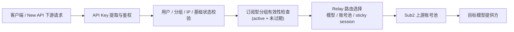

# Sub2 Relay Validity-Only 设计规范

日期：2026-06-25

## 1. 结论摘要

本方案把 **Sub2** 收敛为“**有效性校验 + 路由转发**”的上游 relay/control plane：

- 保留 API key、用户、分组、账号池、渠道状态、健康检查、API key 生成与分组路由能力；
- 对 **订阅型分组** 只保留“是否存在 active 且未过期的订阅”这一层最小有效性判断；
- 从 relay 热路径中移除余额、quota、RPM、subscription usage window、`CheckBillingEligibility(...)` 等计费门禁；
- 计费与用量真相继续由 **New API** 负责，Sub2 不再充当计费权威。

这不是把 Sub2 切到更粗暴的 `simple mode`，而是对当前标准模式做**外科式瘦身**：只拿掉 billing admission，不引入新的拒绝策略，也不新增流式限流器或重 Redis 热检查。

---

## 2. 背景与问题

当前 Yunbay 的部署边界已经明确：

- `New API = 云贝主系统`
- `Sub2API = 独立上游服务`

在这个边界下，Sub2 的职责更像是：

1. 接收 API key；
2. 将 key 解析到用户、分组、账号池；
3. 根据分组与平台把请求转发到合适的上游账号；
4. 提供健康检查、渠道状态、分组/账号管理等控制面能力。

但现在 Sub2 的 relay 热路径里仍然存在多处 billing admission：

- middleware 中的余额 / quota / subscription usage / window maintenance 检查；
- 多个 relay handler 中重复调用 `CheckBillingEligibility(...)`；
- fallback 分支里再次做 billing gate；
- 这些逻辑会把本该只是“路由 + 转发”的请求，在进入上游前先经过多层计费判断。

这会带来三类问题：

1. **额外延迟**：请求必须先经过计费相关判断，增加 first-byte / first-token 开销；
2. **额外复杂度**：relay、计费、限流、订阅状态被耦合在一起，排障困难；
3. **容量浪费**：很多检查本应由 New API 负责，Sub2 再做一遍只会增加热路径负担。

上游开源项目的 README 里虽然有更激进的 `simple mode`，可以整体跳过 billing，但它会把能力收得更广，不适合直接拿来当本次方案。我们只借鉴“**去 billing**”这个方向，不采用整套简化模式。

---

## 3. 设计目标

### 3.1 必须保留的能力

本次修改后，Sub2 仍然必须保留以下能力：

- API key 生成功能；
- API key → group → account pool 的路由关系；
- 上游分组与账号池管理；
- 健康检查状态；
- 渠道状态；
- 用户侧可见的分组 / 渠道 / 监控查询；
- relay 路由本身；
- 订阅型分组的最小有效性校验：**active + 未过期**。

### 3.2 必须移除的能力

以下能力不再属于 Sub2 relay 热路径：

- 余额检查；
- quota 检查；
- RPM / usage window 检查；
- subscription usage window 维护；
- `CheckBillingEligibility(...)`；
- 为了“避免拒绝”而新增的流式限流器；
- 依赖 Redis 的重型热检查；
- fallback 时再次执行 billing gate。

### 3.3 明确边界

本次设计明确只改变 **Sub2** 的 admission 逻辑，不改变以下系统：

- **New API** 的计费、用量、支付、充值、兑换码、账务记录；
- 现有数据库 schema；
- 现有控制面接口的路由结构；
- 现有 relay 的 account selection、sticky session、failover、内容审核；
- 现有 user slot / concurrency 机制；
- 现有 stream / SSE / WebSocket 的输出形态。

---

## 4. 设计原则

### 4.1 Sub2 只做“是否还能转发”的最小判断

对于订阅型分组，Sub2 只回答一个问题：

> 这个分组当前是否仍然存在一个 active 且未过期的订阅？

如果能确认，就继续转发；如果不能确认，就在进入 relay 之前拒绝。

这个判断不负责：

- 余额是否足够；
- 今日 / 本周 / 本月是否超额；
- RPM 是否超限；
- 用户是否还有可用额度；
- 账单是否应该由 Sub2 兜底。

### 4.2 不新增新的拒绝策略

用户已经明确不希望为了节流而拒绝请求，因此本次不引入：

- 新的流式并发上限；
- 新的长连接排队策略；
- 新的 Redis 热拒绝策略；
- 新的 “优先保证吞吐，必要时拒绝” 策略。

Sub2 只保留现有的基础并发控制与路由逻辑，不再叠加新的 admission 层。

### 4.3 不引入新的运行模式

本次不是新增一个 `validity-only` 运行模式，也不是把标准模式替换成 `simple mode`。

实现方式应是：

- 继续使用当前运行模式与路由结构；
- 直接收敛 middleware 与 handler 的 billing 逻辑；
- 不增加新的配置开关来切换本次行为。

这样可以避免再制造一套模式分叉，也便于回滚。

### 4.4 复用现有有效性查询

`SubscriptionService.GetActiveSubscription(...)` 已经是现成的最小有效性来源，并且其底层仓储已经按：

- `status = active`
- `expires_at > now`

进行过滤。

因此本方案不新增第二套订阅查询，也不引入新的 Redis / DB 组合判断；只复用当前服务层能力。

---

## 5. 建议架构

### 5.1 请求路径



### 5.2 控制面与数据面分离

**控制面** 保留以下职责：

- `POST /api/v1/keys`
- `GET /api/v1/keys`
- `GET /api/v1/groups/available`
- `GET /api/v1/channels/available`
- `GET /api/v1/channel-monitors`
- `GET /health`

**数据面 / relay 面** 只负责：

- API key 验证；
- group / account pool 路由；
- 上游模型分发；
- 内容审核；
- account selection / failover；
- 订阅型分组的有效性判断。

### 5.3 现有 concurrency 机制保持不变

本方案不修改现有的：

- `AcquireUserSlotWithWait(...)`
- `TryAcquireUserSlot(...)`
- stream / websocket / SSE 的既有释放逻辑

这些机制仍然是当前唯一保留的请求并发控制，不会被本次方案替换成新的“流式限流器”。

---

## 6. 行为变化说明

### 6.1 订阅型分组

对于绑定到订阅型分组的 API key：

1. 仍然要求 key 有效、用户 active、分组可用、IP 限制通过；
2. 仍然要求能够确认该用户在该分组下存在 active 且未过期的订阅；
3. 不再要求余额、quota、RPM、usage window、subscription usage 等计费门禁；
4. 一旦订阅有效，后续 relay 逻辑直接进入 account selection / forwarding；
5. 如果无法确认 active 且未过期的订阅，则在 middleware 阶段拒绝，避免把请求转发到已经失效的上游池。

### 6.2 非订阅型分组

对于非订阅型分组：

- 不再执行余额门禁；
- 不再执行 quota / RPM 门禁；
- 不再执行 `CheckBillingEligibility(...)`；
- 只保留基础鉴权与分组可用性检查。

### 6.3 relay handler 的变化

所有 relay handler 都必须遵循统一原则：

- **只做路由，不做计费兜底**；
- 不在 handler 中重复检查 `CheckBillingEligibility(...)`；
- 不在 fallback 分支里再做一次计费判断；
- 不把 billing 失败翻译成 relay admission 的标准拒绝理由；
- 不再因为余额、quota、RPM、usage window 而返回 403/429/Retry-After。

### 6.4 Google / Gemini 兼容路径

Gemini / Google 风格的兼容入口必须与标准鉴权保持同样的“有效性-only”语义：

- 仍然支持 Google 风格错误包裹；
- 仍然做 key / user / group / IP / subscription-type group validity 检查；
- 不再做 billing admission。

### 6.5 控制面接口

控制面接口的功能不变：

- API key 仍然可以创建、更新、删除；
- 可用分组仍然可以查询；
- 可用渠道仍然可以查询；
- 渠道监控仍然可以查询；
- `/health` 仍然用于进程健康检查。

这些接口不是 relay billing gate 的一部分，因此不应被这次重构误伤。

---

## 7. 文件级变更范围

### 7.1 必改文件

#### `/Users/ethan/Documents/yunbay/infra/sub2api/backend/internal/server/middleware/api_key_auth.go`

职责收敛为：

- 提取 API key；
- 验证 key / user / group / IP；
- 对订阅型分组做 active + 未过期判断；
- 写入现有上下文 key；
- `TouchLastUsed(...)` 保持不变。

需要移除：

- `skipBilling` 分支；
- 余额检查；
- quota 检查；
- API key rate limit 检查；
- RPM 检查；
- window maintenance；
- billing fallback 逻辑。

#### `/Users/ethan/Documents/yunbay/infra/sub2api/backend/internal/server/middleware/api_key_auth_google.go`

职责收敛为：

- 保留 Google 风格错误包装；
- 保留 key / user / group / IP 基础鉴权；
- 保留订阅型分组 active + 未过期判断；
- 去除余额 / quota / RPM / window maintenance / billing fallback。

#### `/Users/ethan/Documents/yunbay/infra/sub2api/backend/internal/handler/gateway_handler.go`

去掉 `Messages`、`CountTokens`、`Usage`、fallback 分支中的 billing gate；
保留：

- 请求解析；
- 内容审核；
- session hash；
- account selection；
- failover；
- 流式输出；
- 与模型 / 平台相关的既有行为。

#### `/Users/ethan/Documents/yunbay/infra/sub2api/backend/internal/handler/gateway_handler_responses.go`

去掉 Responses 入口的 billing gate，保留协议转换、内容审核与 failover。

#### `/Users/ethan/Documents/yunbay/infra/sub2api/backend/internal/handler/gateway_handler_chat_completions.go`

去掉 Chat Completions 入口的 billing gate，保留协议转换与 stream 处理。

#### `/Users/ethan/Documents/yunbay/infra/sub2api/backend/internal/handler/openai_chat_completions.go`

去掉 OpenAI-compatible chat completions 入口的 billing gate，保留路由选择、流式输出、错误回退。

#### `/Users/ethan/Documents/yunbay/infra/sub2api/backend/internal/handler/openai_gateway_handler.go`

去掉 Responses / Chat Completions / WebSocket 相关入口中的 billing gate，保留 websocket / SSE / failover 行为。

#### `/Users/ethan/Documents/yunbay/infra/sub2api/backend/internal/handler/openai_embeddings.go`

去掉 embeddings 入口的 billing gate。

#### `/Users/ethan/Documents/yunbay/infra/sub2api/backend/internal/handler/openai_images.go`

去掉 images 入口的 billing gate；保留当前图像生成的既有并发控制，不新增“流式节流”。

#### `/Users/ethan/Documents/yunbay/infra/sub2api/backend/internal/handler/gemini_v1beta_handler.go`

去掉 Gemini 入口的 billing gate，保留 Google / Gemini 错误包装与 antigravity 分支。

#### `/Users/ethan/Documents/yunbay/infra/sub2api/backend/internal/server/api_contract_test.go`

锁住必须保留的控制面 contract，确保：

- `/api/v1/keys`
- `/api/v1/groups/available`
- `/api/v1/channels/available`
- `/api/v1/channel-monitors`
- `/health`

持续存在且不会被回归删除。

#### `/Users/ethan/Documents/yunbay/infra/sub2api/backend/internal/server/routes/gateway_test.go`

增加最小 route smoke test，确保 relay 路由没有因为重构丢失。

#### `/Users/ethan/Documents/yunbay/infra/sub2api/backend/internal/server/middleware/api_key_auth_test.go`

补充：

- active subscription 放行；
- missing / expired subscription 拒绝；
- 零余额不再卡住 relay 的行为回归测试。

#### `/Users/ethan/Documents/yunbay/infra/sub2api/backend/internal/server/middleware/api_key_auth_google_test.go`

补充 Google 兼容路径的同类回归测试，确保只依赖 active subscription validity。

#### `/Users/ethan/Documents/yunbay/infra/sub2api/backend/internal/handler/gateway_handler_billing_error_test.go`

保留 helper 层的单元测试；如果有测试专门断言 relay admission 会返回余额 / quota / RPM 错误，则改成“不会再因为 billing 被拒绝”的断言。

### 7.2 明确不改的文件

以下文件保持不改，除非测试暴露了必须的最小清理：

- `/Users/ethan/Documents/yunbay/infra/sub2api/backend/internal/service/billing_cache_service.go`
- `/Users/ethan/Documents/yunbay/infra/sub2api/backend/internal/service/subscription_service.go`
- `/Users/ethan/Documents/yunbay/infra/sub2api/backend/internal/repository/user_subscription_repo.go`
- `/Users/ethan/Documents/yunbay/infra/sub2api/backend/internal/handler/available_channel_handler.go`
- `/Users/ethan/Documents/yunbay/infra/sub2api/backend/internal/handler/channel_monitor_user_handler.go`
- `/Users/ethan/Documents/yunbay/infra/sub2api/backend/internal/handler/api_key_handler.go`
- `/Users/ethan/Documents/yunbay/infra/sub2api/backend/internal/server/routes/user.go`
- `/Users/ethan/Documents/yunbay/infra/sub2api/backend/internal/server/routes/common.go`

原因是：

- 它们已经提供了当前需要的控制面能力；
- 订阅有效性查询已经可以复用；
- 暂不需要为了本次变更去重构服务层或仓储层。

---

## 8. 预期影响

### 8.1 正向效果

1. **降低 relay admission 延迟**
   - 少做一层计费检查，特别是减少热路径上的多次重复调用。

2. **减少 Redis / 缓存压力**
   - billing gate 相关缓存检查从 hot path 里移除。

3. **简化排障**
   - relay 出错时，不再混入一大串计费、配额、窗口维护的分支。

4. **职责更清晰**
   - New API 负责计费；
   - Sub2 负责上游有效性与转发。

5. **保留可用性**
   - 不新增“为了节流而拒绝”的机制；
   - 不把长连接 / 流式请求变成更严格的拒绝策略。

### 8.2 可接受后果

1. **失效订阅会更早被挡住**
   - 这是设计目标，不是回归；
   - 目的是避免继续往已失效的上游池转发。

2. **不再看到 Sub2 返回的计费型 403/429**
   - 余额 / quota / RPM / usage window 相关错误从 Sub2 relay 面移除；
   - 如果前端或下游曾依赖这些错误做提示，需要转向 New API。

3. **不会再通过 Sub2 做“计费兜底”**
   - 这意味着 Sub2 不再承担账务裁决；
   - 任何账务决策必须落到 New API 或专门的账务系统。

4. **如果订阅服务本身不可验证，会按现有有效性校验失败**
   - 这是为了避免把请求继续转发到失效池；
   - 该行为只影响订阅型分组，不影响普通基础鉴权流程。

---

## 9. 风险与兼容性

### 9.1 风险

1. **误删控制面路由**
   - 需要通过 contract test 锁住 `keys / groups / channels / channel-monitors / health`。

2. **误删 relay 路由**
   - 需要通过最小 route smoke test 锁住 `/v1/*`、`/responses`、`/chat/completions` 等入口。

3. **subscription validity 语义偏差**
   - 必须确认“active + 未过期”是唯一剩余的订阅判断标准；
   - 不要把 balance / quota 再塞回来。

4. **billing helper 残留死代码**
   - 先不做大规模清理；
   - 等热路径确认稳定后，再决定是否收尾清理。

### 9.2 兼容性

本次方案对外兼容性总体良好，因为它主要是**删掉不再需要的拒绝条件**，而不是改变成功请求的协议格式。

保留不变的部分包括：

- API key 格式；
- 路由路径；
- 控制面接口；
- 成功响应结构；
- 现有 error envelope 的风格。

变化最大的只有：

- 计费型拒绝会减少；
- 订阅失效会更早被识别；
- relay 热路径会更轻。

---

## 10. 测试策略

### 10.1 单元测试

应补充 / 更新以下测试：

- `/Users/ethan/Documents/yunbay/infra/sub2api/backend/internal/server/middleware/api_key_auth_test.go`
- `/Users/ethan/Documents/yunbay/infra/sub2api/backend/internal/server/middleware/api_key_auth_google_test.go`
- `/Users/ethan/Documents/yunbay/infra/sub2api/backend/internal/handler/gateway_handler_billing_error_test.go`

重点覆盖：

- 订阅型分组 active 订阅放行；
- 订阅型分组缺失 / 过期订阅拒绝；
- 余额为 0 不再导致 relay 拒绝；
- Google 兼容路径仍然可用；
- billing 错误 helper 不再作为 relay admission 的真实分支。

### 10.2 契约测试

应更新 `api_contract_test.go`，确保以下接口继续存在：

- `POST /api/v1/keys`
- `GET /api/v1/keys`
- `GET /api/v1/groups/available`
- `GET /api/v1/channels/available`
- `GET /api/v1/channel-monitors`
- `GET /health`

### 10.3 路由冒烟测试

应更新 `gateway_test.go`，最少覆盖：

- `/v1/messages`
- `/v1/messages/count_tokens`
- `/v1/responses`
- `/v1/chat/completions`
- `/v1/embeddings`
- `/v1/images/generations`
- `/v1/images/edits`
- `/backend-api/codex/responses`

目的不是验证上游模型返回，而是验证这些路径仍然存在，不会因为重构被删掉。

### 10.4 推荐验证命令

```bash
cd /Users/ethan/Documents/yunbay/infra/sub2api/backend
GO_BIN="go"
"$GO_BIN" test ./internal/server/middleware -run 'TestAPIKeyAuthWithSubscription|TestAPIKeyAuthWithSubscriptionGoogle|TestRequireGroupAssignment' -count=1
"$GO_BIN" test ./internal/server -run 'TestAPIContracts|TestGatewayRoutes' -count=1
"$GO_BIN" test ./internal/handler -run 'TestGateway.*|TestOpenAI.*|TestGemini.*|TestAvailableChannel.*|TestChannelMonitorUser.*' -count=1
```

如需更完整的回归，再补一轮：

```bash
"$GO_BIN" test ./internal/server/middleware ./internal/server ./internal/handler ./internal/service -count=1
```

---

## 11. 回滚方案

本次方案**不涉及数据库 schema 迁移**，因此回滚非常直接：

1. 优先回滚 `api_key_auth.go` / `api_key_auth_google.go`；
2. 再回滚各 relay handler 中删除的 billing gate；
3. 保留控制面接口不动；
4. 重启服务或重新构建镜像即可恢复。

如果后续确认 billing helper 已经完全没有调用点，再单独做死代码清理；不要把这部分收尾与主方案耦合。

---

## 12. 验收标准

以下条件全部满足时，本规范对应的设计才算通过：

1. Sub2 relay 热路径不再调用 `CheckBillingEligibility(...)`；
2. Sub2 不再因为余额、quota、RPM、subscription usage window 这类计费条件拒绝 relay 请求；
3. 订阅型分组仍然要求 active 且未过期的订阅；
4. API key / user / group / IP 的基础鉴权仍然存在；
5. API key 生成、分组路由、账号池分发、渠道状态、健康检查仍然可用；
6. `/api/v1/keys`、`/api/v1/groups/available`、`/api/v1/channels/available`、`/api/v1/channel-monitors`、`/health` 不被误删；
7. 没有新增 stream limiter；
8. 没有新增重 Redis 热检查；
9. 没有把 Sub2 重新做成一个完整计费网关；
10. 成功请求的协议形态保持不变，只有拒绝条件收敛。

---

## 13. 最终约束

本规范的核心约束只有一句话：

> **Sub2 只负责验证“这个上游池还能不能用”，不再负责替 New API 做计费裁决。**

