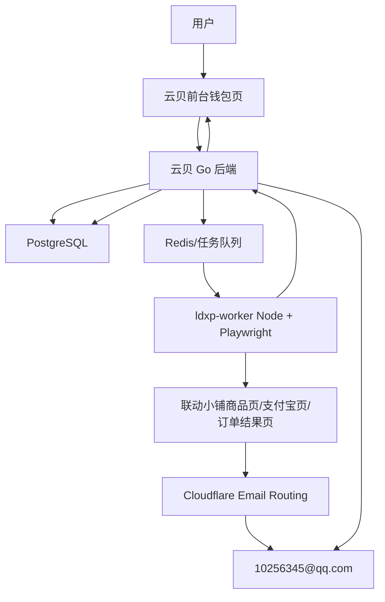

# 联动小铺浏览器 Worker 自动充值设计 Spec

日期：2026-06-28

## 1. 背景

云贝需要在钱包充值页提供固定金额充值入口。用户点击金额后，不直接离开云贝站点，而是由云贝后端调度一个服务器端浏览器 Worker 打开联动小铺商品页，自动填写联系方式并生成支付宝付款二维码。云贝前台展示该二维码，用户扫码付款。付款完成后，Worker 里的页面会自动回跳到联动小铺订单结果页，页面中包含订单号、付款状态和卡密。与此同时，联动小铺会向商品下单时填写的邮箱发送购买成功邮件，邮件中也包含订单号、金额、付款时间和购买内容/卡密。

本设计把“Worker 页面结果”和“邮件结果”做交叉核验：

```text
Worker 页面订单号 == 邮件订单号
Worker 页面卡密 == 邮件卡密
Worker 页面金额 == 邮件金额 == 云贝 session 金额
Worker 页面订单状态 == 已付款
```

核验通过后，云贝再执行最终入账。推荐最终入账仍使用云贝自身可信卡密体系：管理员预先在云贝生成 `paid_topup` 卡密并导入联动小铺商品库存；Worker 提取联动小铺返回的卡密后调用云贝内部兑换逻辑，兑换成功才标记充值成功。

## 2. 实施前置要求

1. 实施本方案之前，必须先查看 GitHub 上的 `yunbay` 项目状态，确认本地分支、远端最新提交、未合并改动和生产部署分支关系，再开始写实现代码。
2. 实施和部署时如需登录生产服务器、Cloudflare、邮箱、支付平台或其它云贝相关服务，所需连接信息和密钥以本机桌面 `云贝` 文件夹中的私密资料为准。该文件夹仅作为本地凭据来源，不得把其中的密码、授权码、Token、私钥或完整连接密钥写入 Git、日志、截图、PR、issue 或公开聊天。
3. 读取本地 `云贝` 文件夹中的凭据时，只能读取与当前实施/部署步骤直接相关的条目；回复和文档中只描述“已配置/缺失/需要轮换”等状态，不复述实际 secret 值。

## 3. 已确认事实

### 3.1 联动小铺前台流程

从用户提供的四张流程截图已确认：

1. 商品页地址形如：

   ```text
   https://pay.ldxp.cn/item/n4aqh8
   ```

2. 商品页包含：
   - 商品名，例如 `0.1 元测试`；
   - 商品金额，例如 `¥0.1`；
   - 联系方式输入框，placeholder 类似 `请输入联系方式方便查询订单`；
   - 支付方式按钮 `支付宝`；
   - 底部购买按钮 `立即购买`。

3. 点击支付后进入支付宝收银台页面，地址形如：

   ```text
   https://excashier.alipay.com/standard/auth.htm?payOrderId=PAY_ORDER_ID
   ```

4. 支付宝收银台页面显示：
   - 订单号，例如 `LD260628UZJ97P`；
   - 金额，例如 `0.10 元`；
   - 支付宝扫码二维码。

5. 用户扫码支付成功约 5 秒后，Worker 页面自动回跳到联动小铺订单结果页，地址形如：

   ```text
   https://pay.ldxp.cn/order/result/LD260628UZJ97P
   ```

6. 订单结果页显示：
   - 订单号；
   - 商品名称；
   - 数量；
   - 创建时间；
   - 订单金额；
   - 订单状态，例如 `已付款`；
   - 已发货卡密内容。

7. 联动小铺购买成功邮件显示：
   - 商品名称，例如 `0.1 元测试`；
   - 实付金额，例如 `0.10元`；
   - 数量；
   - 付款时间；
   - 单号，例如 `LD260628UZJ97P`；
   - 购买内容/卡密。

### 3.2 当前邮件链路

云贝当前邮件链路分为出站和入站两条：

```text
出站系统邮件：yunbay-new-api -> Resend SMTP -> 用户邮箱
入站/回复邮件：support@yunbay.xyz -> Cloudflare Email Routing -> 10256345@qq.com
```

生产环境现状：

1. 云贝后台当前出站 SMTP 使用 `smtp.resend.com:465`，发件地址为 `support@yunbay.xyz`。
2. `support@yunbay.xyz` 经 Cloudflare Email Routing 转发到 QQ 邮箱 `10256345@qq.com`。
3. 该 QQ 邮箱此前已配置过 SMTP/授权码；本方案按“已有 QQ 邮箱客户端授权码可用于 IMAP/POP3 读取”作为实现前提。
4. MVP 不需要先接 Resend Inbound，也不强制接 Cloudflare Email Worker；可以先通过 QQ IMAP 轮询收取联动小铺购买成功邮件。

### 3.3 当前生产部署基础

生产服务器已有：

```text
Docker / Docker Compose
PostgreSQL
Redis
Caddy HTTPS 反向代理
yunbay-new-api 主服务容器
```

当前生产服务器未部署：

```text
Playwright Worker / Browserless / Puppeteer / Chromium worker
IMAP 邮件监听器
联动小铺自动充值 session 表与接口
```

### 3.4 云贝卡密与充值记录基础

生产数据库已具备卡密充值扩展字段：

```text
redemptions.kind
redemptions.amount
redemptions.money
redemptions.count_as_top_up
redemptions.batch_id
redemptions.source
redemptions.exported_time
```

`top_ups` 表也已具备充值记录字段：

```text
trade_no
amount
money
payment_method
payment_provider
status
```

因此自动充值最终可以复用云贝现有 paid top-up 卡密兑换和充值记录体系。

## 4. 目标

### 4.1 用户体验目标

1. 钱包页展示联动小铺自动充值入口。
2. 展示固定金额卡片：

   ```text
   10 元、20 元、30 元、50 元、100 元、500 元
   ```

3. 当前阶段六个金额先全部绑定同一个商品链接：

   ```text
   https://pay.ldxp.cn/item/n4aqh8
   ```

   后续再改为每个金额各自的正式商品链接。

4. 用户点击金额后，云贝前台打开支付弹窗或支付面板。
5. 弹窗显示状态：
   - 正在创建订单；
   - 正在生成支付宝付款码；
   - 请使用支付宝扫码支付；
   - 等待支付完成；
   - 已检测到订单，正在等待邮件确认；
   - 支付已确认，正在同步卡密；
   - 充值成功。
6. 用户只需要在云贝页面扫码，不需要手动跳转联动小铺，不需要手动复制卡密。
7. 若超时或失败，前台展示 session 编号和可读错误，便于客服人工排查。

### 4.2 后端业务目标

1. 云贝创建联动小铺自动充值 session。
2. 后端调度浏览器 Worker 打开联动小铺商品页。
3. Worker 自动填写联系方式。
4. Worker 进入支付宝收银台并提取：
   - 联动小铺订单号；
   - 支付金额；
   - 支付二维码截图/base64。
5. 云贝前台显示二维码。
6. Worker 等待支付成功后的结果页，并提取：
   - 结果页订单号；
   - 商品名；
   - 金额；
   - 订单状态；
   - 卡密。
7. 邮件监听器读取 QQ 邮箱中的联动小铺购买成功邮件。
8. 邮件解析器提取：
   - 邮件订单号；
   - 商品名；
   - 实付金额；
   - 数量；
   - 付款时间；
   - 卡密。
9. 核验 Worker 结果和邮件结果一致。
10. 核验成功后执行云贝入账。
11. 入账过程必须幂等，同一 session、同一联动订单号、同一卡密不得重复入账。

### 4.3 安全与审计目标

1. 不依赖联动小铺商家后台，不保存联动小铺商家后台账号密码。
2. 不只凭“页面出现支付成功”入账。
3. 不只凭“收到邮件”入账。
4. 最终成功必须同时满足：

   ```text
   Worker 订单结果可信
   邮件订单结果可信
   两边订单号/金额/卡密一致
   云贝入账事务成功
   ```

5. 推荐最终入账使用云贝 paid_topup 卡密兑换，避免外部页面或邮件被伪造导致直接加余额。
6. 日志和错误信息不得泄露完整密钥、邮箱授权码、数据库密码、SMTP Token。
7. 可以保存卡密到 session 表用于审计，但用户可见接口不应无必要返回完整卡密；前端只需要展示充值成功状态。
8. 失败时保存 Worker 截图/HTML 摘要/URL/错误码，方便页面改版后排查。

## 5. 非目标

本轮不做：

1. 不接入联动小铺官方 API，因为当前没有确认开放 API。
2. 不登录联动小铺商家后台抓订单列表。
3. 不实现微信支付、银行卡支付或其它支付方式；MVP 只做支付宝。
4. 不实现完整财务对账后台；MVP 只保存 session 和 mail event 供查询。
5. 不替代已有 Stripe、Creem、Waffo、Epay 等支付网关流程。
6. 不修改或删除项目受保护标识、项目名、组织名、版权声明、README attribution 等。
7. 不把 QQ 邮箱授权码、Resend Token、Cloudflare Token 写入 Git 仓库。

## 6. 术语

### 6.1 LDXP session

云贝为一次联动小铺自动充值创建的内部会话，绑定用户、金额、商品链接、Worker 状态、邮件状态和最终入账结果。

### 6.2 Worker 订单号

浏览器 Worker 在支付宝收银台页或联动小铺订单结果页中读取到的订单号，例如：

```text
LD260628UZJ97P
```

### 6.3 邮件订单号

QQ 邮箱收到的联动小铺购买成功邮件中解析出的单号。

### 6.4 卡密

联动小铺订单结果页或购买成功邮件中展示的购买内容。推荐该卡密由云贝后台预先生成并导入联动小铺商品库存。

### 6.5 支付已确认

不是单一页面状态，而是以下条件同时成立：

```text
Worker 页面显示已付款
Worker 订单号 == 邮件订单号
Worker 金额 == 邮件金额 == session 期望金额
Worker 卡密 == 邮件卡密
```

### 6.6 充值成功

支付已确认后，云贝完成内部入账事务。推荐定义为：

```text
支付已确认 + 云贝 paid_topup 卡密兑换成功
```

## 7. 总体架构



建议实现形态：

1. `yunbay-new-api` 继续负责用户认证、session 管理、状态接口、核验和入账。
2. 新增独立容器 `yunbay-ldxp-worker`，使用 Node.js + Playwright + Chromium。
3. 邮件监听器可以先写在 Go 后端中作为后台 goroutine，也可以做独立 worker；MVP 优先放 Go 后端，减少部署组件。
4. Worker 与后端通过内部 HTTP API 或 Redis 队列通信。
5. 前端通过轮询读取 session 状态；MVP 不强制 WebSocket/SSE。

## 8. 数据模型设计

### 8.1 新增 `ldxp_topup_sessions`

建议新增 GORM 模型，表名：

```text
ldxp_topup_sessions
```

字段：

| 字段 | 类型建议 | 说明 |
| --- | --- | --- |
| `id` | integer primary key | 自增主键 |
| `session_id` | varchar(64), unique | 对外查询用 session ID |
| `user_id` | integer, index | 云贝用户 ID |
| `amount` | bigint | 用户选择的充值面值，例如 10、20 |
| `money` | numeric/float | 实际支付金额；测试商品可为 0.10，正式商品应与金额配置一致 |
| `product_url` | text | 联动小铺商品链接 |
| `product_name` | text | 期望商品名或 Worker 读取到的商品名 |
| `contact_email` | varchar(255) | Worker 填写的联系方式，例如 `support@yunbay.xyz` 或后续 `ldxp@yunbay.xyz` |
| `status` | varchar(64), index | session 状态 |
| `qr_code` | text | 支付二维码 base64 或内部文件路径；建议生产保存文件路径/短期缓存 |
| `qr_ready_time` | bigint | 二维码生成时间 |
| `worker_order_no` | varchar(64), index | Worker 读取到的订单号 |
| `worker_amount` | numeric/float | Worker 读取到的金额 |
| `worker_product_name` | text | Worker 读取到的商品名 |
| `worker_card_key` | varchar(255) | Worker 读取到的卡密 |
| `worker_status_text` | varchar(64) | Worker 读取到的订单状态，例如 `已付款` |
| `worker_success_url` | text | 订单结果页 URL |
| `worker_detected_time` | bigint | Worker 提取结果时间 |
| `mail_message_id` | varchar(255) | 匹配到的邮件 message id |
| `mail_order_no` | varchar(64), index | 邮件解析订单号 |
| `mail_amount` | numeric/float | 邮件解析金额 |
| `mail_product_name` | text | 邮件解析商品名 |
| `mail_card_key` | varchar(255) | 邮件解析卡密 |
| `mail_from` | varchar(255) | 邮件发件人 |
| `mail_to` | varchar(255) | 邮件收件人 |
| `mail_subject` | text | 邮件标题 |
| `mail_received_time` | bigint | 邮件接收时间 |
| `verified_time` | bigint | 订单核验通过时间 |
| `redeemed_time` | bigint | 入账完成时间 |
| `topup_id` | integer | 关联 `top_ups.id`，如果可取得 |
| `redemption_id` | integer | 关联 `redemptions.id`，如果使用卡密兑换模式 |
| `error_code` | varchar(64) | 错误码 |
| `error_message` | text | 错误摘要 |
| `debug_snapshot_path` | text | Worker 失败截图/HTML 快照路径 |
| `created_time` | bigint | 创建时间 |
| `updated_time` | bigint | 更新时间 |
| `expired_time` | bigint | 过期时间 |

索引建议：

```text
unique(session_id)
index(user_id)
index(status)
index(worker_order_no)
index(mail_order_no)
index(created_time)
```

如果数据库支持条件唯一索引可加：

```text
unique(worker_order_no) where worker_order_no <> ''
```

为兼容 SQLite/MySQL/PostgreSQL，MVP 可先用普通索引和事务内显式检查，避免条件索引跨库差异。

### 8.2 新增 `ldxp_mail_events`

建议新增表：

```text
ldxp_mail_events
```

字段：

| 字段 | 类型建议 | 说明 |
| --- | --- | --- |
| `id` | integer primary key | 自增主键 |
| `message_id` | varchar(255), unique | 邮件 Message-ID；为空时使用 raw_hash 去重 |
| `imap_uid` | varchar(128) | IMAP UID 或 UIDVALIDITY+UID |
| `raw_hash` | varchar(128), unique | 邮件原文 hash，用于兜底去重 |
| `mail_from` | varchar(255) | 发件人 |
| `mail_to` | varchar(255) | 收件人 |
| `subject` | text | 标题 |
| `received_time` | bigint | 接收时间 |
| `order_no` | varchar(64), index | 解析出的订单号 |
| `amount` | numeric/float | 解析出的金额 |
| `product_name` | text | 解析出的商品名 |
| `card_key` | varchar(255) | 解析出的卡密 |
| `paid_time` | bigint | 付款时间，若可解析 |
| `body_excerpt` | text | 脱敏正文摘要 |
| `matched_session_id` | varchar(64), index | 匹配到的 session |
| `processed` | bool | 是否已处理 |
| `error_message` | text | 解析或匹配错误 |
| `created_time` | bigint | 创建时间 |

用途：

1. 防止重复处理同一封邮件。
2. 保存未匹配邮件，后续 Worker 结果到达后可再次匹配。
3. 邮件模板变化时方便重新解析和排查。

## 9. 配置设计

### 9.1 后端配置项

建议新增 options 或环境变量，MVP 可先写入 options：

```text
LDXPEnabled=true
LDXPProductLinks={"10":"https://pay.ldxp.cn/item/n4aqh8","20":"https://pay.ldxp.cn/item/n4aqh8","30":"https://pay.ldxp.cn/item/n4aqh8","50":"https://pay.ldxp.cn/item/n4aqh8","100":"https://pay.ldxp.cn/item/n4aqh8","500":"https://pay.ldxp.cn/item/n4aqh8"}
LDXPContactEmail=support@yunbay.xyz
LDXPWorkerToken=通过生产 secret 配置的随机长密钥，不写入 Git
LDXPMailIMAPHost=imap.qq.com
LDXPMailIMAPPort=993
LDXPMailIMAPSSL=true
LDXPMailUsername=10256345@qq.com
LDXPMailPassword=通过生产 secret 配置的 QQ 邮箱客户端授权码，不写入 Git
LDXPMailPollIntervalSeconds=5
LDXPMaxConcurrentSessions=3
LDXPQrTimeoutSeconds=60
LDXPPaymentTimeoutSeconds=900
LDXPMailConfirmTimeoutSeconds=300
LDXPSessionTTLSeconds=1200
```

敏感项不得提交到 Git：

```text
LDXPWorkerToken
LDXPMailPassword
```

### 9.2 商品链接配置

当前用户已确认：六个金额先全部绑定同一个测试/商品链接。

```json
{
  "10": "https://pay.ldxp.cn/item/n4aqh8",
  "20": "https://pay.ldxp.cn/item/n4aqh8",
  "30": "https://pay.ldxp.cn/item/n4aqh8",
  "50": "https://pay.ldxp.cn/item/n4aqh8",
  "100": "https://pay.ldxp.cn/item/n4aqh8",
  "500": "https://pay.ldxp.cn/item/n4aqh8"
}
```

注意：

1. 该链接截图中商品金额为 `0.1 元测试`，正式充值上线前需要把每个金额替换为对应正式商品链接。
2. 在当前统一链接阶段，系统应清晰标注为测试/临时配置，避免用户误以为点击 500 元实际购买 500 元商品。
3. 若仍使用统一 0.1 元测试链接进行开发验证，自动入账应只在测试账号/测试环境启用，避免真实生产充值金额不一致。

### 9.3 联系邮箱配置

MVP 使用：

```text
support@yunbay.xyz
```

邮件路径：

```text
support@yunbay.xyz -> Cloudflare Email Routing -> 10256345@qq.com -> 云贝 IMAP 读取
```

正式上线推荐新增专用别名：

```text
ldxp@yunbay.xyz -> 10256345@qq.com
```

这样可避免客服邮件和自动充值邮件混在一起。

## 10. 后端 API 设计

### 10.1 用户创建 session

```text
POST /api/user/ldxp/topup/session
```

请求：

```json
{
  "amount": 10
}
```

规则：

1. 用户必须登录。
2. `amount` 只能是：`10,20,30,50,100,500`。
3. 若 `LDXPEnabled=false`，返回不可用。
4. 若该用户已有未完成 session，可选择：
   - 复用未过期 session；或
   - 取消旧 session 后创建新 session。MVP 推荐同一用户同一时间只允许一个 active session。
5. 创建 session 后把任务投递给 Worker。

响应：

```json
{
  "success": true,
  "data": {
    "session_id": "ldxp_sample_session",
    "amount": 10,
    "status": "created",
    "expires_at": 1780000000
  }
}
```

### 10.2 用户查询 session

```text
GET /api/user/ldxp/topup/session/:session_id
```

响应：

```json
{
  "success": true,
  "data": {
    "session_id": "ldxp_sample_session",
    "amount": 10,
    "status": "alipay_qr_ready",
    "qr_code": "data:image/png;base64,BASE64_QR_IMAGE",
    "order_no": "LD260628UZJ97P",
    "expires_at": 1780000000,
    "error_code": "",
    "error_message": ""
  }
}
```

安全规则：

1. 用户只能查询自己的 session。
2. 非管理员接口不返回完整卡密。
3. 若 status 已成功，返回充值成功摘要即可。

### 10.3 用户取消 session

```text
POST /api/user/ldxp/topup/session/:session_id/cancel
```

规则：

1. 仅允许取消未入账 session。
2. 后端通知 Worker 关闭页面/context。
3. 已入账 session 不允许取消。

### 10.4 Worker 回传二维码

```text
POST /api/ldxp/worker/session/:session_id/qr
```

鉴权：

```text
X-Yunbay-LDXP-Worker-Token: 生产环境配置的随机长密钥
```

请求：

```json
{
  "order_no": "LD260628UZJ97P",
  "amount": 0.10,
  "product_name": "0.1 元测试",
  "qr_code": "data:image/png;base64,BASE64_QR_IMAGE",
  "cashier_url": "https://excashier.alipay.com/standard/auth.htm?payOrderId=PAY_ORDER_ID"
}
```

后端更新：

```text
status = alipay_qr_ready
worker_order_no = order_no
worker_amount = amount
qr_code = qr_code 或文件路径
```

### 10.5 Worker 回传订单结果

```text
POST /api/ldxp/worker/session/:session_id/result
```

请求：

```json
{
  "order_no": "LD260628UZJ97P",
  "amount": 0.10,
  "product_name": "0.1 元测试",
  "status_text": "已付款",
  "card_key": "9470548686742880",
  "result_url": "https://pay.ldxp.cn/order/result/LD260628UZJ97P"
}
```

后端更新：

```text
status = worker_result_detected
worker_order_no = order_no
worker_amount = amount
worker_product_name = product_name
worker_status_text = status_text
worker_card_key = card_key
worker_success_url = result_url
```

随后触发核验：

```text
如果已存在 mail event 且订单号一致 -> 尝试 verify
否则 status = waiting_mail_confirm
```

### 10.6 Worker 回传错误

```text
POST /api/ldxp/worker/session/:session_id/error
```

请求：

```json
{
  "error_code": "alipay_qr_timeout",
  "error_message": "支付宝二维码未在 60 秒内出现",
  "current_url": "https://pay.ldxp.cn/order/result/LD_SAMPLE_ORDER",
  "snapshot_path": "/app/logs/ldxp-worker/snapshots/ldxp_sample_session.png"
}
```

后端更新 session 失败状态，但已付款且后续邮件/结果可恢复的 session 不应被简单删除。

## 11. Worker 设计

### 11.1 技术选型

推荐：

```text
Node.js + Playwright + Chromium
```

部署为独立容器：

```text
yunbay-ldxp-worker
```

原因：

1. 浏览器自动化与 Go 主进程隔离。
2. Playwright 对页面等待、截图、选择器、跳转监听支持成熟。
3. 失败可保存 trace/screenshot/HTML。
4. 后续联动页面改版时只需要改 Worker。

### 11.2 Worker 核心流程

```text
1. 拉取或接收 session 任务
2. 创建独立 browser context/page
3. 打开 product_url
4. 等待商品页加载
5. 填写 contact_email
6. 选择支付宝
7. 点击立即购买
8. 等待跳转到 excashier.alipay.com
9. 解析支付宝页订单号和金额
10. 截取二维码区域
11. 回传二维码给云贝后端
12. 等待跳转到 pay.ldxp.cn/order/result/{order_no}
13. 解析结果页订单号、金额、商品名、订单状态、卡密
14. 回传订单结果给云贝后端
15. 关闭 page/context
```

### 11.3 页面选择器策略

商品页优先定位：

```text
placeholder: 请输入联系方式方便查询订单
text: 支付宝
text: 立即购买
```

支付宝页识别：

```text
URL includes excashier.alipay.com
body text includes 订单号
body text includes 元
```

结果页识别：

```text
URL matches /order/result/{order_no}
body text includes 订单详情
body text includes 订单状态
body text includes 已付款
body text includes 第1张 或 您购买的卡密
```

### 11.4 解析正则

订单号：

```regex
订单号[:：]\s*([A-Z0-9]+)
```

金额：

```regex
(?:订单金额[:：]\s*)?￥?\s*([0-9]+(?:\.[0-9]+)?)\s*元?
```

卡密：

```regex
第\s*1\s*张\s*([A-Za-z0-9_-]{6,128})
```

兜底：在结果页中查找“已发货 1 张”之后的第一段长 token。

### 11.5 二维码提取策略

按优先级：

1. 定位二维码容器并截图。
2. 定位二维码 `` 并读取 `src`。
3. 若二维码是 canvas，执行 `canvas.toDataURL('image/png')`。
4. 若 DOM 不稳定，截取页面中部固定区域。
5. 失败时保存整页截图并返回 `alipay_qr_parse_failed`。

### 11.6 并发限制

MVP 推荐：

```text
LDXPMaxConcurrentSessions=3
```

每个 session 一个 browser context/page。超过并发限制时排队。

### 11.7 超时

建议：

```text
商品页加载超时：30 秒
支付宝二维码生成超时：60 秒
等待支付超时：15 分钟
等待订单结果页超时：2 分钟（支付后）
等待邮件确认超时：5 分钟
session 总 TTL：20 分钟
```

## 12. 邮件监听与解析设计

### 12.1 邮箱接入

MVP 使用 QQ IMAP：

```text
host: imap.qq.com
port: 993
ssl: true
username: 10256345@qq.com
password: QQ 邮箱客户端授权码
mailbox: INBOX
```

说明：

1. 这是读取 Cloudflare 转发到 QQ 邮箱的联动小铺购买成功邮件。
2. 授权码不得写入仓库。
3. 若 IMAP 授权码不可用，可临时改用 POP3 或手动重新生成授权码。

### 12.2 轮询策略

MVP：

```text
每 5 秒轮询新邮件
只读取最近 N 小时未处理邮件
按 Message-ID / IMAP UID / raw_hash 去重
```

解析成功后写入 `ldxp_mail_events`。

### 12.3 邮件过滤

过滤条件：

```text
发件人或标题包含：链动小铺
正文包含：单号
正文包含：以下是您的购买内容
正文包含：实付
```

如果后续新增 `ldxp@yunbay.xyz`，优先只处理收件人为该地址的邮件。

### 12.4 邮件解析正则

商品名：

```regex
感谢购买商品\s*(.+)
```

实付金额：

```regex
实付\s*([0-9]+(?:\.[0-9]+)?)\s*元
```

数量：

```regex
数量[:：]\s*(\d+)
```

付款时间：

```regex
付款时间\s*([0-9]{4}-[0-9]{2}-[0-9]{2}\s+[0-9]{2}:[0-9]{2}:[0-9]{2})
```

订单号：

```regex
单号[:：]\s*([A-Z0-9]+)
```

卡密：

```regex
以下是您的购买内容[:：]?\s*([A-Za-z0-9_-]{6,128})
```

解析时要兼容中文冒号、英文冒号、逗号、换行和 HTML 标签。

### 12.5 邮件与 session 匹配

优先级：

1. `mail_order_no == session.worker_order_no`。
2. 若 Worker 尚未回传订单结果，但二维码阶段已拿到订单号，则仍可匹配。
3. 金额、商品名、时间窗口作为附加校验。
4. 未匹配邮件先保存，等 Worker 回传后再次尝试。

## 13. 核验与入账设计

### 13.1 核验条件

必须满足：

```text
session.status in [alipay_qr_ready, waiting_payment, worker_result_detected, waiting_mail_confirm]
session.worker_order_no != ''
session.mail_order_no != ''
session.worker_order_no == session.mail_order_no
session.worker_card_key != ''
session.mail_card_key != ''
session.worker_card_key == session.mail_card_key
session.worker_status_text contains 已付款
session 未过期
session 未成功入账
```

金额校验：

```text
worker_amount == mail_amount
```

正式商品上线后还必须满足：

```text
session.amount 对应的 product_url 与当前 session.product_url 一致
session.amount 对应的期望支付金额 == worker_amount == mail_amount
```

当前统一测试链接阶段，因测试商品金额为 `0.1`，不得直接按用户选择的 `10/20/...` 入账到真实生产用户，除非明确启用测试模式或把商品链接改为正式金额商品。

### 13.2 入账模式 A：云贝卡密兑换，推荐

前提：

```text
联动小铺商品库存中的卡密由云贝后台 paid_topup 批量生成并导入
```

流程：

```text
核验订单通过
        ↓
调用云贝内部兑换逻辑兑换 worker_card_key
        ↓
兑换成功：增加用户额度、创建 top_ups 记录、标记 redemption 已使用
        ↓
标记 ldxp session success
```

优点：

1. 卡密真实性由云贝数据库决定。
2. 不信任外部页面/邮件提供的金额来决定最终额度。
3. 复用已有 paid_topup 统计、充值历史和审计。
4. 伪造邮件无法凭空制造有效云贝卡密。

### 13.3 入账模式 B：订单直充，备选

如果联动小铺卡密不是云贝生成，则可按订单核验直接充值。

规则：

1. 只按 `session.amount` 对应的云贝配置入账，不按页面传入金额随意入账。
2. `worker_order_no` 必须唯一。
3. `worker_card_key` 必须未被其它成功 session 使用。
4. 创建 `top_ups` 记录：

   ```text
   trade_no = LDXP_{order_no}
   payment_method = ldxp_browser_worker
   payment_provider = ldxp
   status = success
   ```

5. 该模式安全性弱于卡密兑换模式，正式上线前应优先采用模式 A。

### 13.4 幂等事务

最终入账必须在事务中执行：

```text
BEGIN
SELECT ldxp_topup_sessions WHERE session_id = ? FOR UPDATE
如果 status == success：返回成功，不重复入账
检查订单号/金额/卡密/状态
检查 order_no 是否已被其它成功 session 使用
模式 A：兑换卡密
模式 B：增加用户额度并创建 top_up
更新 session.status = success
COMMIT
```

如果任一步失败：

```text
ROLLBACK
session.status = redeem_failed 或 verify_failed
记录 error_code/error_message
```

## 14. 前端设计

### 14.1 钱包页入口

在钱包充值卡片中新增联动小铺自动充值区域：

```text
联动小铺自动充值
点击金额后系统会生成支付宝付款码，扫码支付后自动同步充值结果。
```

金额按钮：

```text
10 元、20 元、30 元、50 元、100 元、500 元
```

当前阶段按钮全部使用后端配置中的同一个商品链接，不由前端硬编码。

### 14.2 支付弹窗状态

状态文案：

| 状态 | 前端文案 |
| --- | --- |
| `created` | 正在创建订单... |
| `opening_product` | 正在打开联动小铺商品页... |
| `submitting_order` | 正在生成支付宝付款码... |
| `alipay_qr_ready` | 请使用支付宝扫码支付 |
| `waiting_payment` | 等待支付完成，请勿关闭窗口 |
| `worker_result_detected` | 已检测到订单结果，正在等待邮件确认... |
| `waiting_mail_confirm` | 正在核对联动小铺发货邮件... |
| `payment_verified` | 支付已确认，正在同步卡密... |
| `redeeming_or_crediting` | 正在为账户充值... |
| `success` | 充值成功 |
| failed states | 充值同步失败，请复制 session 编号联系管理员 |

### 14.3 二维码展示

弹窗内容：

```text
金额：{{amount}} 元
订单号：{{order_no}}
二维码图片
支付剩余时间
```

注意：

1. 订单号可以展示，便于用户客服沟通。
2. 不展示完整卡密，除非业务明确要求。
3. 若二维码过期，允许用户关闭并重新创建 session。

### 14.4 轮询

MVP 使用轮询：

```text
每 2 秒 GET /api/user/ldxp/topup/session/:session_id
```

停止条件：

```text
status == success
status in failed terminal states
session expired
用户手动取消
```

## 15. 安全设计

1. Worker token 和 IMAP 授权码只放生产 secret 或后台加密配置，不提交 Git。
2. Worker 内部 API 必须鉴权，不能被公网任意调用。
3. 如果 Worker API 暴露在 Caddy 后面，必须限制来源或要求强 token；推荐仅 Docker 内网访问。
4. 用户只能查询自己的 session。
5. session ID 使用高熵随机值，不使用递增 ID 暴露给前端。
6. 二维码只对发起 session 的用户返回。
7. 同一用户同一时间限制 active session 数量。
8. 同一联动订单号只能入账一次。
9. 同一卡密只能入账一次。
10. 邮件重复读取必须通过 `message_id`、`imap_uid` 或 `raw_hash` 去重。
11. 不以用户前端提交的金额、订单号、卡密决定入账。
12. 订单核验和入账必须在数据库事务中完成。
13. 失败截图和 HTML 快照不得直接公开给普通用户。
14. 日志中避免输出完整邮箱授权码、SMTP Token、数据库密码、Worker token。

## 16. 运营流程

### 16.1 推荐正式运营流程

```text
1. 云贝后台按面值生成 paid_topup 卡密批次
2. 管理员导出对应面值卡密
3. 管理员导入联动小铺对应商品库存
4. 云贝配置每个金额对应的正式商品链接
5. 用户在云贝钱包页点击金额
6. Worker 生成支付宝二维码
7. 用户扫码支付
8. Worker 和邮件双向核验订单号/金额/卡密
9. 云贝兑换卡密并入账
10. 用户看到充值成功
```

### 16.2 当前测试配置注意事项

当前六个金额先全部绑定：

```text
https://pay.ldxp.cn/item/n4aqh8
```

该截图中商品名为 `0.1 元测试`，金额为 `0.10`。因此：

1. 该配置适合 POC 和自动化开发验证。
2. 正式对用户开放前，必须替换为真实金额商品链接，或启用明确测试模式。
3. 如果仍用该测试链接，不能按用户选择的 10/20/30/50/100/500 给真实用户入账。

## 17. 测试策略

### 17.1 后端单元测试

覆盖：

1. 创建 session 只接受固定金额。
2. 创建 session 时正确加载商品链接配置。
3. Worker QR 回调保存订单号、金额和二维码状态。
4. Worker 结果回调保存订单号、金额、状态和卡密。
5. 邮件解析器能解析样例正文：

   ```text
   感谢购买商品0.1 元测试
   实付0.10元
   数量:1,
   付款时间2026-06-28 03:37:42
   单号:LD260628UZJ97P,
   以下是您的购买内容:
   9470548686742880
   ```

6. 邮件重复 message id 不重复处理。
7. Worker 订单号与邮件订单号不一致时拒绝核验。
8. 卡密不一致时拒绝核验。
9. 金额不一致时拒绝核验。
10. 已成功 session 重复核验不会重复入账。
11. 模式 A 中卡密兑换失败时 session 标记 `redeem_failed`，不创建重复充值记录。

### 17.2 Worker POC 测试

用测试商品链接验证：

```text
https://pay.ldxp.cn/item/n4aqh8
```

验证内容：

1. 能打开商品页。
2. 能填写联系方式。
3. 能点击支付宝和立即购买。
4. 能进入支付宝收银台。
5. 能提取订单号。
6. 能截取二维码。
7. 支付后能等待回跳结果页。
8. 能提取订单号、金额、已付款状态和卡密。
9. 失败时保存截图。

### 17.3 邮件集成测试

1. 用 QQ IMAP 授权码登录 `10256345@qq.com`。
2. 读取最新联动小铺购买成功邮件。
3. 解析订单号、金额、商品名、卡密。
4. 与 Worker 订单结果匹配。
5. 同一封邮件重复轮询不会重复写入。

### 17.4 前端测试

1. 钱包页展示 6 个金额按钮。
2. 点击金额后创建 session。
3. `alipay_qr_ready` 时展示二维码和订单号。
4. `success` 时提示充值成功并刷新余额。
5. 失败状态展示错误和 session 编号。
6. i18n key 覆盖 en、zh、fr、ja、ru、vi。

### 17.5 手工验收

1. 使用测试商品发起 0.1 元真实支付。
2. 前台显示支付宝二维码。
3. 手机扫码支付。
4. Worker 检测结果页。
5. QQ 邮箱收到联动小铺邮件。
6. 云贝解析邮件并核对订单号。
7. 如果使用测试模式，确认只标记测试成功，不给真实用户充值正式金额。
8. 替换正式商品链接后，再用小额正式 paid_topup 卡密做端到端验证。

## 18. 上线顺序

1. 备份数据库。
2. 部署后端 session/mail event 表和 API。
3. 配置 LDXP secret，但不启用用户入口。
4. 部署 `yunbay-ldxp-worker` 容器。
5. 用测试商品链接做 POC。
6. 验证 QQ IMAP 邮件读取。
7. 验证订单号/金额/卡密核验。
8. 在后台生成少量 paid_topup 卡密并导入联动小铺测试商品。
9. 仅管理员或测试账号启用前端入口。
10. 端到端验证成功后，替换 10/20/30/50/100/500 正式商品链接。
11. 小流量开放给用户。
12. 监控失败 session、Worker 日志和邮件解析错误。

## 19. 回滚方案

### 19.1 功能关闭

设置：

```text
LDXPEnabled=false
```

前端隐藏联动小铺自动充值入口。

### 19.2 Worker 回滚

停止并移除：

```text
yunbay-ldxp-worker
```

不影响云贝主服务、现有兑换码、其它支付渠道。

### 19.3 数据回滚

新增表可保留，不影响旧功能。

如某个 session 出错：

1. 未付款：标记 `cancelled` 或 `expired`。
2. 已付款但未入账：管理员根据联动订单号、邮件、卡密人工处理。
3. 已误入账：通过现有管理员额度调整和审计日志修正，不直接删除历史记录。

## 20. 风险与处理

### 20.1 测试链接与正式金额不一致

风险：当前六个金额都绑定 0.1 元测试商品，如果直接按按钮金额入账会造成损失。

处理：

1. 在测试链接阶段只允许测试账号使用。
2. 后端校验商品支付金额与 session 配置一致。
3. 正式上线前必须替换为正式商品链接。

### 20.2 联动小铺页面改版

风险：选择器失效、二维码位置变化、订单结果页文案变化。

处理：

1. Worker 使用多策略定位和正则解析。
2. 失败保存截图和 HTML 摘要。
3. Worker 独立部署，便于快速热修。

### 20.3 QQ 邮箱 IMAP 失效

风险：授权码过期、QQ 安全策略拦截、IMAP 连接断开。

处理：

1. 邮件监听器自动重连。
2. 后台显示邮件监听健康状态。
3. 保留人工处理路径。
4. 后续可迁移到 Cloudflare Email Worker 或 Resend Inbound webhook。

### 20.4 邮件延迟

风险：用户已付款，但邮件延迟到达。

处理：

1. 前台显示“正在等待邮件确认”。
2. 默认等待 5 分钟。
3. 超时后保留 session，后续邮件到达可继续匹配并入账，或进入人工处理。

### 20.5 重复入账

风险：Worker 重试、邮件重复拉取、用户刷新导致重复操作。

处理：

1. session 加事务锁。
2. order_no 唯一检查。
3. card_key 唯一检查。
4. topup trade_no 唯一检查。
5. 已 success session 直接返回成功，不重复执行入账。

### 20.6 邮件或页面伪造

风险：攻击者伪造邮件或构造回调。

处理：

1. Worker 回调使用内部 token。
2. 邮件仅作为核验信号之一。
3. 推荐最终使用云贝 paid_topup 卡密兑换作为入账依据。
4. 不信任前端提交订单号或卡密。

## 21. 涉及文件建议

### 21.1 后端新增/修改

建议新增：

```text
/Users/ethan/Documents/yunbay/model/ldxp_topup_session.go
/Users/ethan/Documents/yunbay/model/ldxp_mail_event.go
/Users/ethan/Documents/yunbay/service/ldxp_session.go
/Users/ethan/Documents/yunbay/service/ldxp_mail.go
/Users/ethan/Documents/yunbay/service/ldxp_verify.go
/Users/ethan/Documents/yunbay/controller/ldxp_topup.go
```

修改：

```text
/Users/ethan/Documents/yunbay/model/main.go
/Users/ethan/Documents/yunbay/router/api-router.go
/Users/ethan/Documents/yunbay/setting 或 common/options 相关配置文件
```

测试：

```text
/Users/ethan/Documents/yunbay/service/ldxp_mail_test.go
/Users/ethan/Documents/yunbay/service/ldxp_verify_test.go
/Users/ethan/Documents/yunbay/controller/ldxp_topup_test.go
```

### 21.2 Worker 新增

建议新增：

```text
/Users/ethan/Documents/yunbay/infra/ldxp-worker/package.json
/Users/ethan/Documents/yunbay/infra/ldxp-worker/src/index.ts
/Users/ethan/Documents/yunbay/infra/ldxp-worker/src/ldxp-flow.ts
/Users/ethan/Documents/yunbay/infra/ldxp-worker/src/api-client.ts
/Users/ethan/Documents/yunbay/infra/ldxp-worker/src/parser.ts
/Users/ethan/Documents/yunbay/infra/ldxp-worker/Dockerfile
```

### 21.3 前端 default 修改

建议新增/修改：

```text
/Users/ethan/Documents/yunbay/web/default/src/features/wallet/components/ldxp-topup-card.tsx
/Users/ethan/Documents/yunbay/web/default/src/features/wallet/components/ldxp-payment-dialog.tsx
/Users/ethan/Documents/yunbay/web/default/src/features/wallet/hooks/use-ldxp-topup.ts
/Users/ethan/Documents/yunbay/web/default/src/features/wallet/api.ts
/Users/ethan/Documents/yunbay/web/default/src/features/wallet/types.ts
/Users/ethan/Documents/yunbay/web/default/src/features/wallet/index.tsx
/Users/ethan/Documents/yunbay/web/default/src/i18n/locales/en.json
/Users/ethan/Documents/yunbay/web/default/src/i18n/locales/zh.json
/Users/ethan/Documents/yunbay/web/default/src/i18n/locales/fr.json
/Users/ethan/Documents/yunbay/web/default/src/i18n/locales/ja.json
/Users/ethan/Documents/yunbay/web/default/src/i18n/locales/ru.json
/Users/ethan/Documents/yunbay/web/default/src/i18n/locales/vi.json
```

### 21.4 部署修改

建议修改：

```text
/Users/ethan/Documents/yunbay/docker-compose.prod.yml
```

新增服务：

```text
yunbay-ldxp-worker
```

新增挂载：

```text
/opt/new-api/logs/ldxp-worker:/app/logs
/opt/new-api/logs/ldxp-worker/snapshots:/app/snapshots
```

## 22. 验收标准

1. 钱包页显示 10/20/30/50/100/500 六个金额按钮。
2. 当前配置下六个按钮都能发起同一测试商品链接的 Worker 流程。
3. Worker 能自动填写联系方式。
4. Worker 能生成支付宝二维码并回传给前台。
5. 前台能展示二维码，用户可扫码支付。
6. Worker 能从支付宝页或订单结果页读取订单号。
7. 支付成功后 Worker 能进入联动小铺结果页。
8. Worker 能读取订单状态 `已付款` 和卡密。
9. 邮件监听器能从 QQ 邮箱读取联动小铺购买成功邮件。
10. 邮件解析器能解析订单号、金额、商品名和卡密。
11. 后端能核验 Worker 订单号与邮件订单号一致。
12. 后端能核验 Worker 卡密与邮件卡密一致。
13. 核验失败不会入账。
14. 核验成功后，模式 A 能成功兑换云贝 paid_topup 卡密并入账。
15. 同一订单/卡密重复回调不会重复入账。
16. 支付或邮件超时会显示可理解错误，并保留 session 供人工排查。
17. Worker 失败时保存截图或调试快照。
18. 新增前端文案完成 en、zh、fr、ja、ru、vi 翻译。
19. 后端测试通过。
20. 前端构建通过。
21. Worker POC 在测试商品上跑通。

## 23. 最终决策摘要

本方案采用“浏览器 Worker + QQ 邮箱邮件核验 + 云贝内部入账”的自动充值架构。云贝前台只展示金额按钮和支付宝二维码；服务器端 Playwright Worker 负责打开联动小铺商品页、填写联系方式、生成二维码、等待支付结果页并提取订单号和卡密；云贝后端通过 QQ IMAP 读取 Cloudflare 转发到 `10256345@qq.com` 的联动小铺购买成功邮件，解析订单号和卡密；后端要求 Worker 页面结果与邮件结果在订单号、金额、卡密上全部一致，然后才执行入账。正式推荐使用云贝生成的 paid_topup 卡密导入联动小铺库存，最终通过云贝卡密兑换成功来标记充值成功。

当前阶段六个金额暂时都绑定 `https://pay.ldxp.cn/item/n4aqh8`，适合 POC 和端到端验证；正式对用户开放前应替换为各金额对应的正式商品链接，并确保商品金额、云贝 session 金额和 paid_topup 卡密面值一致。
